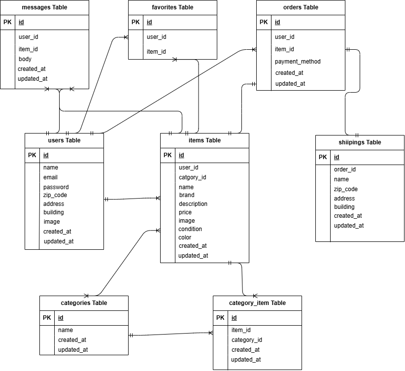

# COACHTECH フリマ（Laravel）

## 概要

Laravel + MySQL + Docker で動くフリマアプリです。  
ユーザー登録/ログイン（Fortify）、出品、購入、配送先設定、プロフィール画像アップロード（Storage）などを実装。

## 使用技術

- PHP 8.4.6 / Laravel 8.83.8
- MySQL 8.0.26
- Blade / CSS
- Laravel Fortify（認証）
- Stripe（決済・予定/対応中）
- Docker（nginx, php-fpm, mysql, phpmyadmin）
- Storage（`storage/app/public` → `public/storage`）

## 環境構築

**Docker ビルド**

1. `git clone git@github.com:hiroya-0425/mockcase1.git
2. DockerDesktop アプリを立ち上げる
3. `docker-compose up -d --build`

**Laravel 環境構築**

1. `docker-compose exec php bash`
2. `composer install`
3. 「.env.example」ファイルを コピーして「.env」を作成し、DB の設定を変更

```text
DB_HOST=mysql
DB_DATABASE=laravel_db
DB_USERNAME=laravel_user
DB_PASSWORD=laravel_pass
```

5. アプリケーションキーの作成

```bash
php artisan key:generate
```

6. マイグレーションの実行

```bash
php artisan migrate
```

7. シーディングの実行

```bash
php artisan db:seed
```

# 起動 URL

- アプリ: http://localhost
- phpMyAdmin: http://localhost:8080

# キャッシュクリア

```bash
php artisan config:clear
php artisan route:clear
php artisan cache:clear
php artisan view:clear
```

## テストユーザー

※「管理者ユーザー」は権限付きアカウントではなく、代表的なログイン用アカウントです。

### 管理者ユーザー（代表アカウント）

- email: hiroya-ydh@outlook.jp
- password: hirohiroya

### 一般ユーザー

- email: sudou@example.jp
- password: sudoutakumi

# ディレクトリ構成（主要）

app/ # コントローラ/モデル/リクエスト 等
resources/ # Blade, CSS, 画像
public/ # 公開ディレクトリ（/storage シンボリックリンク有）
storage/ # アップロード保存先（app/public/...）
database/ # マイグレーション/シーダー/ファクトリ

# 補足

このアプリケーションは「フリマアプリ」を想定して作成されています。
出品から購入、配送先登録まで一連の流れを体験できるよう設計されています。
プロフィール画像のアップロードや認証（Fortify）など、実際の開発案件に近い構成になっています。

## ER 図

以下は本アプリケーションのテーブル構成とリレーションを示した ER 図です。



## テスト一覧（tests/Feature）

本プロジェクトは PHPUnit による機能テストを用意しています。各テストがカバーする要件は以下の通りです。

- `RegisterTest.php`（会員登録機能）
  - 名前未入力でバリデーションメッセージ
  - メール未入力でバリデーションメッセージ
  - パスワード未入力でバリデーションメッセージ
  - パスワード7文字以下でバリデーションメッセージ
  - 確認用パスワード不一致でバリデーションメッセージ
  - 全項目が正しければ登録成功＆プロフィール設定画面へ遷移

- `LoginTest.php`（ログイン機能）
  - メール未入力でバリデーションメッセージ
  - パスワード未入力でバリデーションメッセージ
  - 誤った資格情報でエラー（auth.failed）
  - 正しい資格情報でログイン成功＆トップへ遷移

- `LogoutTest.php`（ログアウト機能）
  - ログアウトボタン押下でログアウト処理が実行される

- `ItemIndexTest.php`（商品一覧取得）
  - 全商品が表示される
  - 購入済み商品に「Sold」表示
  - ログインユーザーの出品商品は一覧に表示しない

- `FavoriteIndexTest.php`（マイリスト一覧取得）
  - いいねした商品だけが表示される
  - 購入済み商品に「Sold」表示
  - 未認証の場合は何も表示されない

- `ItemSearchTest.php`（商品検索機能）
  - 商品名の部分一致で検索できる
  - 検索キーワードがマイリストタブでも保持される（かつマイリスト側でも検索が効く）

- `ItemShowTest.php`（商品詳細情報取得）
  - 画像／商品名／ブランド名／価格／説明／状態／複数カテゴリが表示される
  - いいね数が表示される
  - コメント数・コメント本文・コメントユーザーが表示される

- `ShippingChangeTest.php`（配送先変更機能）
  - 送付先変更が購入画面に反映される
  - 購入時に shippings に送付先住所が紐づいて保存される

- `UserProfileTest.php`（ユーザー情報取得）
  - プロフィール画像・ユーザー名・出品商品一覧・購入商品一覧が表示される

- `UserUpdateTest.php`（ユーザー情報変更）
  - プロフィール編集ページで画像／名前／郵便番号／住所の初期値が表示される

- `ItemStoreTest.php`（出品商品情報登録）
  - カテゴリ・状態・商品名・ブランド名・説明・価格が保存される（ピボット含む）
  - 画像アップロード時に `storage/app/public` 保存＆DB にパスが登録される

### テスト実行方法
```bash
# テスト用DBを使用して全テスト実行
php artisan test

# 個別実行例
php artisan test --filter=LoginTest

```

